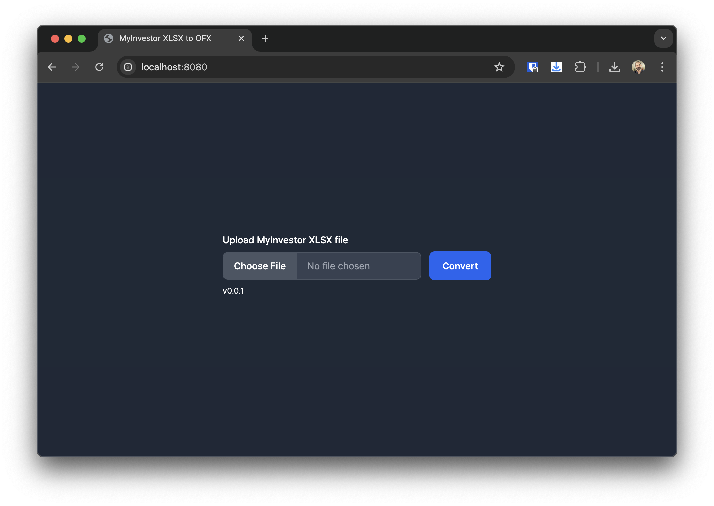

# MyInvestor XLSX to OFX

A little express application to convert MyInvestor XLSX to OFX format.



## Installation

```sh
$ npm i
```

## Running the application

```sh
$ npm start
```

Then you can open your favourite browser and navigate to http://localhost:8080
